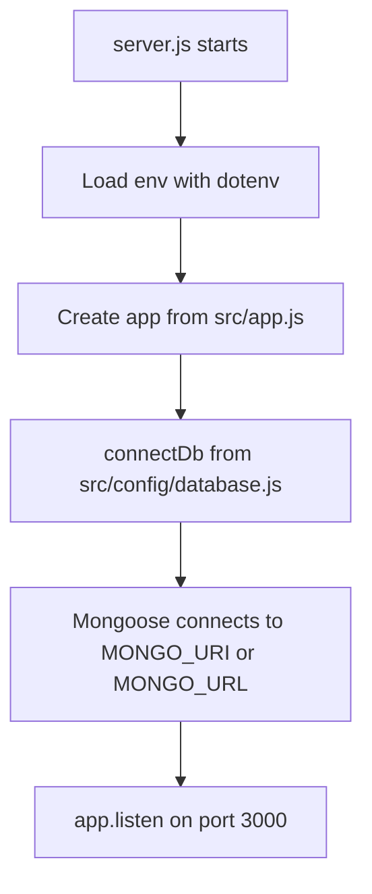
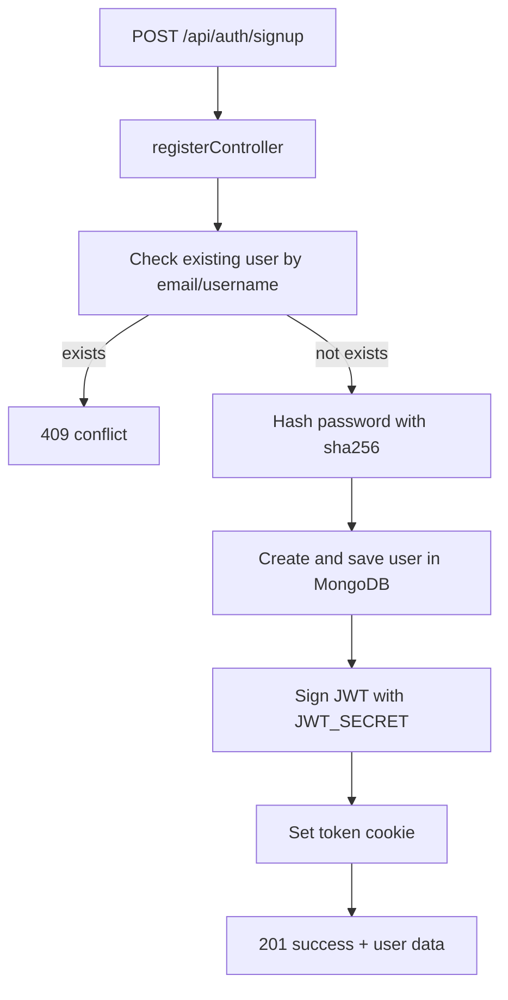
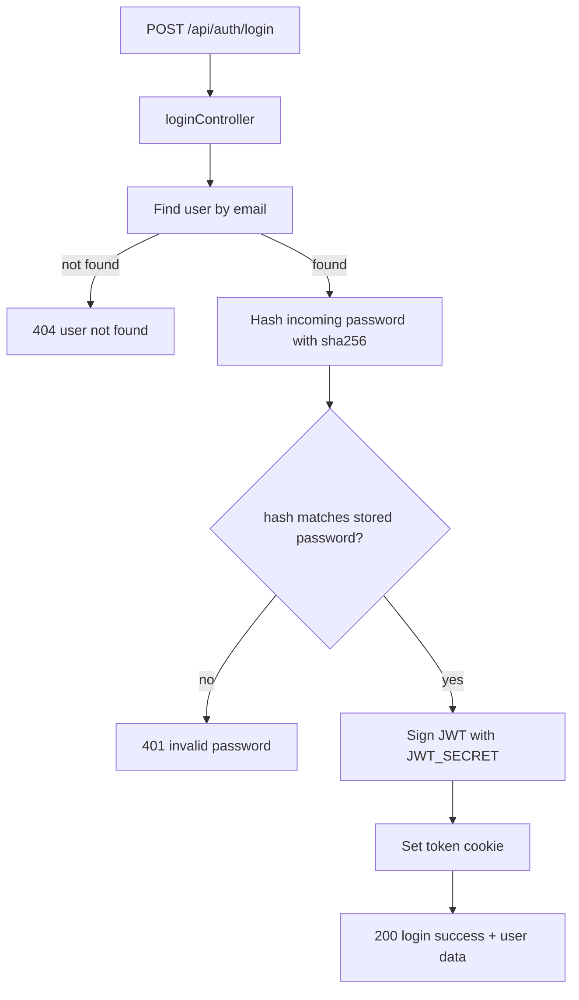
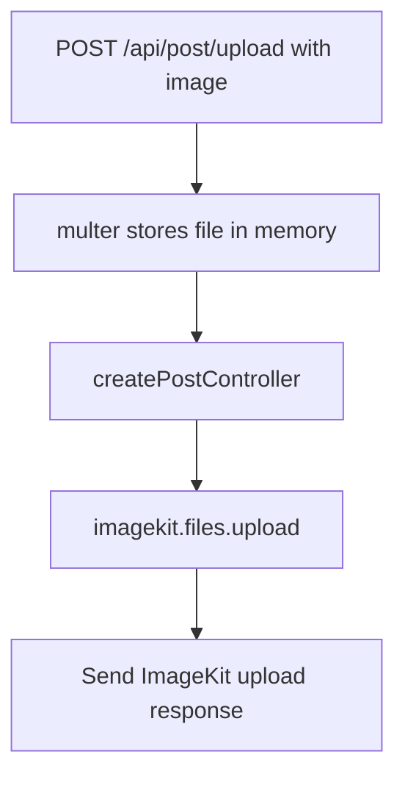

# InstaClone Backend Flow

This project is an Express + MongoDB backend with two main modules:

- Auth (`/api/auth`)
- Post upload (`/api/post`)

## 1) App Startup Flow



## 2) Request Routing Flow

```mermaid
flowchart LR
	A[Client Request] --> B[Express JSON + cookie-parser middleware]
	B --> C{Route Prefix}
	C -->|/api/auth| D[src/routes/auth.route.js]
	C -->|/api/post| E[src/routes/post.route.js]

	D --> F[POST /signup -> registerController]
	D --> G[POST /login -> loginController]

	E --> H[multer memoryStorage + uploadImage.single(image)]
	H --> I[POST /upload -> createPostController]
```

## 3) Auth Flow (Signup/Login)





## 4) Post Upload Flow



## 5) Data Layer

- `users` collection (`src/models/user.model.js`): username, email, hashed password, bio, profile image.
- `posts` collection (`src/models/post.model.js`): caption, image URL, user reference, time.

Note: current `createPostController` uploads the image to ImageKit and returns the upload result, but it does not yet save a post document using `postModel`.
